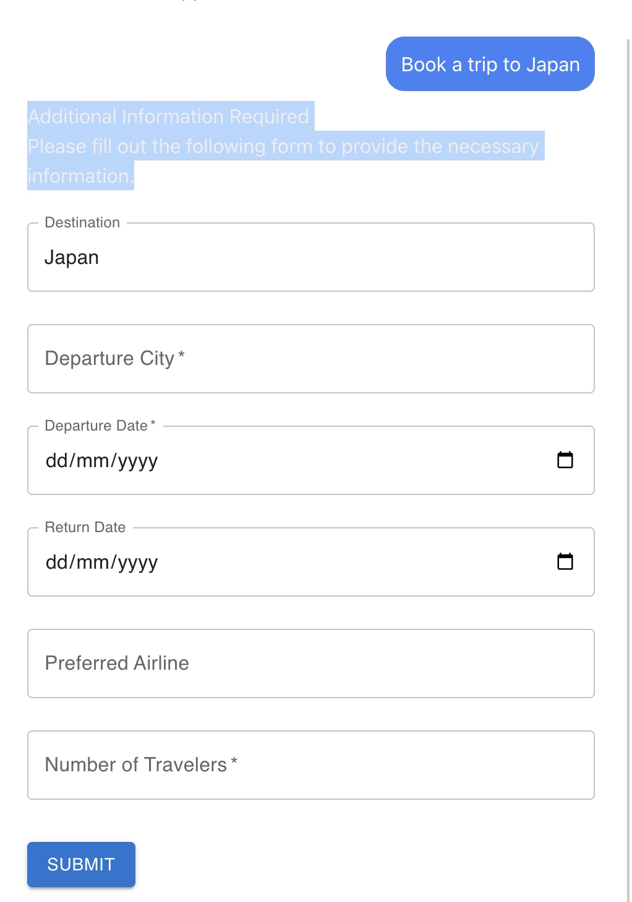
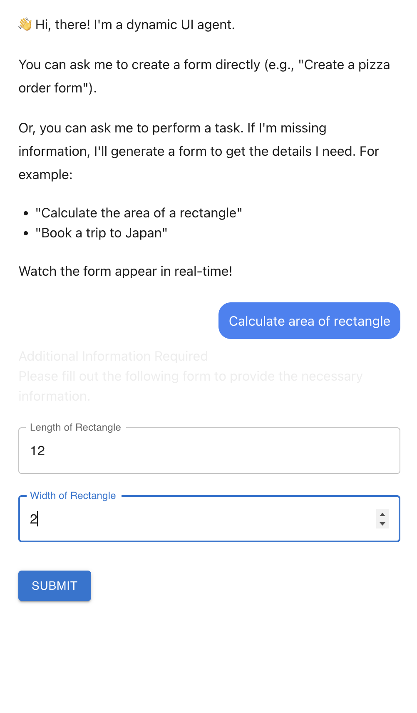

# AHITL-protocol: A Proof-of-Concept

This repository contains a proof-of-concept (POC) implementation of the **AHITL (Agentic Human in the loop)** protocol. AHITL is an open protocol that enables AI agents to generate interactive UI components on demand, creating a bidirectional communication layer between reasoning models and human users.

For a detailed explanation of the protocol, please see [spec.md](spec.md).

## How it Works

The ahitl protocol defines a standardized way for an AI agent to request structured information from a user by sending a `ahitl_form` message containing a JSON schema. A ahitl-compliant client can then render a form based on this schema. When the user submits the form, the client sends a `ahitl_response` message back to the agent with the user's input.

This POC demonstrates the ahitl protocol with two main components:

1.  **A Python-based AI agent**: Built with LangChain and LangGraph, this agent can be prompted to ask for structured information.
2.  **A Next.js web application**: This acts as the ahitl client, capable of rendering the forms sent by the agent and returning the user's input.

## Getting Started

### Prerequisites

-   Node.js and npm
-   Python 3.8+ and [uv](https://github.com/astral-sh/uv)

### Installation and Running the Project

The `start.sh` script automates the setup and execution of both the agent and the web application.

1.  **Clone the repository:**

    ```bash
    git clone https://github.com/AgentBossMode/ahitl-protocol.git
    cd ahitl-protocol
    ```

2.  **Run the start script:**

    ```bash
    ./start.sh
    ```

This script will:

-   Install the necessary npm packages for the web application.
-   Set up the Python environment for the agent using `uv`.
-   Start the Next.js development server for the web application (available at `http://localhost:3000`).
-   Start the LangGraph agent (available at `http://localhost:8123`).

## How This Codebase Implements the Spec

### Agent (`ahitl/agent/`)

The Python agent, built with LangChain and LangGraph, is responsible for generating `ahitl_form` messages. When the agent needs structured information from the user, it uses a tool that constructs a JSON schema and sends it to the client.

The agent's ability to ask questions is defined as a tool within the LangGraph framework. The `ask_question` tool, defined in `ahitl/agent/agent.py`, is decorated with `@tool`, making it available to the LangGraph agent.

```python
# ahitl/agent/agent.py

@tool 
def ask_question(question: str, uiSchema: str) -> str:
    '''Asks the user for structured information by generating a form.
    
    This tool should be used when you need to gather multiple pieces of information
    from the user to proceed. The `question` parameter must be a serialized JSON string that
    conforms to the react-jsonschema-form (RJSF) schema.
    
    The agent is responsible for generating the RJSF schema as a JSON string
    based on the information it needs to collect from the user.
    
    Args:
        question: A serialized JSON string representing a form schema that adheres to react-jsonschema-form.
        uiSchema: A serialized JSON string representing the UI schema for the form.
    '''
    print(f"Interrupting to ask question: {question}")
    print(f"With uiSchema: {uiSchema}")

    # wrap the question into the ahitl_form format
    question = {
        "type": "ahitl_form",
        "title": "Additional Information Required",
        "description": "Please fill out the following form to provide the necessary information.",
        "schema": question,
        "uiSchema": uiSchema
    }
    value = interrupt(question)
    print(f"Received answer: {value}")
    return value
```

This tool takes a JSON schema and a UI schema as input, wraps them in a `ahitl_form` message, and then uses the `interrupt` function from LangGraph to send the form to the client and wait for a response.

### Client (`ahitl/`)

The Next.js web application serves as the ahitl client. It uses CopilotKit to manage communication with the agent and render the UI.

#### Rendering the Dynamic UI

The main page of the application (`ahitl/src/app/page.tsx`) uses the `useLangGraphInterrupt` hook from CopilotKit to listen for `ahitl_form` messages from the agent. When a message is received, it renders a form using `react-jsonschema-form`.

```tsx
// ahitl/src/app/page.tsx

// ...
  useLangGraphInterrupt<string>({
    render: ({ event, resolve }) => {
      let ahitl_form: any = {};
      try {
        // The event.value can be a JSON string or an object representing the ahitl form.
        if (typeof event.value === 'string') {
          console.log("Parsing ahitl form from string:", event.value);
          ahitl_form = JSON.parse(event.value);
        } else if (typeof event.value === 'object' && event.value !== null) {
          ahitl_form = event.value;
        }

        if (ahitl_form.type !== 'ahitl_form' || !ahitl_form.schema) {
          throw new Error("Invalid ahitl form structure.");
        }

      } catch (error) {
        console.error("Failed to parse ahitl form:", error);
        // Gracefully handle cases where the value is not a valid ahitl form
        resolve(JSON.stringify({ type: "ahitl_error", message: "Invalid ahitl form structure.", payload: event.value }));
        return null;
      }

      const onSubmit = (data: IChangeEvent) => {
        // When the form is submitted, we resolve the promise with the form data.
        // The agent expects a ahitl_response message.
        resolve(JSON.stringify({ type: "ahitl_response", data: data.formData }));
      };

      return (
        <div>
          <h2>{ahitl_form.title}</h2>
          <p>{ahitl_form.description}</p>
          <Form schema={JSON.parse(ahitl_form.schema)} uiSchema={JSON.parse(ahitl_form.uiSchema)} validator={validator} onSubmit={onSubmit} />
        </div>
      );
    },
  });
// ...
```

When the user submits the form, the `onSubmit` function sends the data back to the agent as a `ahitl_response` message.

This implementation demonstrates the core principles of the ahitl protocol, providing a practical example of how AI agents can dynamically generate user interfaces to gather structured data.

## Examples

### Booking trip to Japan



### Calculate area of Rectangle

